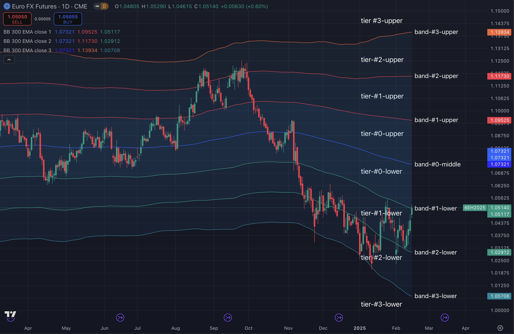

# LIATS (Lifelong Investor Algorithmic Trading System)

## Project Structure

- Packages: core, indicator, equity, future, forex, option, crypto...
- The bin folder includes variety of scripts to deploy and maintain the project
- The live folder includes all live accounts' config and strategies
- The docs folder includes guidelines, baseline, mindset and notes
- The regress folder includes regression testing results

## Develop with Lean CLI and PyCharm

- Writing Algorithms: https://www.quantconnect.com/docs/v2/writing-algorithms
- Interactive Brokers: https://github.com/QuantConnect/Lean.Brokerages.InteractiveBrokers
- Interactive Brokers: https://www.quantconnect.com/docs/v2/cloud-platform/live-trading/brokerages/interactive-brokers
- IB Market Data Pricing: https://www.interactivebrokers.com/en/pricing/research-news-marketdata.php
- IB Market Data Subscribe: https://www.quantconnect.com/docs/v2/cloud-platform/datasets/interactive-brokers#09-Pricing
- API Reference: https://www.quantconnect.com/docs/v2/writing-algorithms/api-reference
- GitHub Code: https://github.com/QuantConnect/Lean

### Get Login Credentials

- Go to: https://www.quantconnect.com/settings/
- Click: Request Email With Token and Your User-Id for API Requests
- Check your email to get the user id and token

### Install Lean CLI and PyCharm

- Refer to Lean CLI Doc: https://www.quantconnect.com/docs/v2/lean-cli/installation/installing-pip
- Install Anaconda as suggested: https://docs.anaconda.com/anaconda/install/
- Install or upgrade lean, it's fine to see dependencies conflicts error.
    - You might need to update `/Users/<Home>/.config/pip/pip.conf`

```
% pip install --upgrade lean
```

- Use user id and token to login (login QuantConnect to send token in email)

```
% lean login -u xxxx -t xxxxxxxxxxxx
```

- Init lean under home directory

```
% mkdir lean
% cd lean
% lean init
```

- Pull projects from QuantConnect

```
 % lean cloud pull
```

### Integrate with GitHub

#### Solution 1: Start from scratch if not project created yet

- You can create a project on QuantConnect or local as below

```
% lean project-create --language python liats
```

- Let's say we already have a project liats under lean dir

```
% cd liats
```

- Clone git repo to this liats dir

```
# Remove or back up existing unmanaged files if necessary
% rm main.py research.ipynb

% git init
% git remote add origin git@github.com:codebycase/liats.git
% git fetch origin
% git checkout develop
```

#### Solution 2: Just check out git repo if project existed

- Clone liats repo to the lean dir

```
% cd ~/lean
% git clone git@github.com:codebycase/liats.git
```

- Copy secret keys over to dir `~/lean/secret/`

#### Additional settings

- Append bin path to the system PATH

```
# MacOS
% vi ~/.zshrc
export PATH="$PATH:/opt/homebrew/opt/openjdk@17/bin:$HOME/lean/liats/bin"
```

```
# Linux
$ vi ~/.profile
if [ -d "$HOME/lean/liats/bin" ] ; then
    PATH="$HOME/lean/liats/bin:$PATH"
fi
```

- Now you can create a branch on top of develop branch

### Integrate with PyCharm IDE

- Copy .idea initial settings

```
% cp -rf docs/.idea ./
```

- Open liats project with PyCharm

### Lean CLI cloud backtest

- Push changes to cloud

```
% lean cloud push --project liats
```

- Run backtest on cloud
- `--push` will push local modifications to the cloud before running the backtest
- `--open` will try to open the backtest result/editor on default browser

```
% lean cloud backtest liats --push --open
```

- Or simply use backtest command:

```
% backtest liats
% backtest LifelongPaper
```

## System Maintenance

### Recreate test project liats

- Login QuantConnect
- Delete project liats
- Create a new project (New Algorithm)
- Rename the project to liats (lowercase)

### Create a new account LifelongHedge

- Copy live/LifelongPaper to live/LifelongHedge

```
% cp -r live/LifelongPaper live/LifelongHedge
```

- Update main.py accordingly

```
setAlgoName("LifelongHedge")
addNotifySetting(LINotifyType.TELEGRAM, "-913280749")  # LIATS Test
addAlertSetting(LINotifyType.EMAIL, "lifelonginvestorllc@gmail.com")
Set trading strategies as well....
```

- Add credential key under ~/lean/secret

**Use single quote to support special characters!**

```
% vi secret/LifelongHedge.key
ACCOUNT_ID=Uxxxxxxxx
USERNAME=xxxxxx
PASSWORD='******'
```

- Assign a new live trading node to this account

### Deploy for Live Trading

- Adjust settings live/LifelongHedge/main.py whenever needed

- Run deployment script as `deploy LifelongHedge`
- Run recreate script as `recreate LifelongHedge`
- Run stop script as `stop LifelongHedge`

- Check the status of a cloud project

```
% lean cloud status LifelongHedge
Project id: 12345678
Project name: LifelongHedge
Project url: https://www.quantconnect.com/project/12345678
Live status: Running
Live id: L-e2970930d923e89a61a3f30c0512dade
Live url: https://www.quantconnect.com/project/12345678/live
Brokerage: Interactive Brokers
Launched: 2022-11-11 13:21:12 UTC
```

### Stops live trading and liquidates existing positions for a certain project.

- To be able to liquidate manually, need to set `self.Settings.LiquidateEnabled = True` in main.py first!

```
% lean cloud live liquidate LifelongPaper
```

### Switch Lean User with login

- login can be used to switch Lean user easily.
- Add credential key under ~/lean/secret

```
% vi secret/lean-llc-token.key
USER_ID=xxxxxx
API_TOKEN=xxxxxxxxxxxxxx
```

- Login to user llc: `login llc`

## Troubleshooting

### Check IB System Status

- [IB System Status](https://www.interactivebrokers.com/en/software/systemStatus.php)

### Add an IB Trading User

- Add an IB Trading User without 2-factors authentication been enabled by mistake.
- While entering your mobile number in your profile, don't choose Yes button for SMS authentication.
- Also never try to scan the QR code and enable IB Mobile app authentication by mistake.

### Backtest divergence with live trading

- Seeing large gap/divergence between backtest and live which could misleading us a lot!
- To avoid possible slippage, always backtest with LIConfigKey.limitOrderJitterRatio: 0

### Error: 'Outside Regular Trading Hours' is ignored

- Sample: Live Handled Error: Brokerage Warning: Order Event Warning:Attribute 'Outside Regular Trading Hours' is ignored based on the order type and
  destination. PlaceOrder is now being processed.. Origin: [Id=32993] IBPlaceOrder: MCL19G24 (FUT MCL USD NYMEX 20240119 0 )
- This kind of error can be safely ignored. Since the market is open now, the stop order can be placed right away, it is no meaning to set 'Outside
  Regular Trading Hours', but we by default set this property.

### Error: "Cannot push 'liats': File exceeds the maximum size of 128,000 characters..."

- Need to try following things to reduce the size of the python source code:
    - Delete some deprecate comments or code lines.
    - Refactor to reduce some duplicate blocks.
    - Rename some variables to be shorter.
    - Move out some common methods.

### The QuantConnect online editor stales

- [Lean Issues](https://github.com/QuantConnect/Lean/issues)
- Please delete the project if the QuantConnect online editor won't reflect your pushed/recent changes.
- Then use above backtest push command to recreate the project.

## Trading Guidelines

- Check the [Trading Guidelines](docs/guidelines/trading-guidelines.md)
- Check the [Trading Strategies](docs/guidelines/trading-strategies.md)
- Check the [Trading Annual Fees](docs/guidelines/trading-annual-fees.md)

### Subscribe IB's Market Data for the trading account

- Please note to subscribe market data for the trading account, not the other monitor/report account.
- For paper account, need to enable sharing for market data.
- Wait for 24 hrs to get effective.

### Disable or enable a trading strategy

- Better to use this setting to disable or enable a trading strategy as it will take care the liquidation and also clean up the session
  metadata: `LIConfigKey.liquidateAndStopTrading: True,`

### How to pick a future contract to trade?

[NinjaTrader Futures](https://ninjatrader.com/PDF/ninjatrader_futures_contract_details.pdf)

- To find the right day trading futures contract, you should consider three main factors: volume, margins, and movement.
- Based on volume, margins, and movement you now have a few choices to consider. If you are starting, trade the E-Mini S&P 500 or the 10-Year Treasury
  note. Both produce lots of movement and volume each day, as well as low day trading margins.
- As you progress, you may also consider crude oil futures. They have a slightly lower volume than the prior two, are more volatile and have higher
  day trading margins. That means you should have a more extensive account to trade it. Eurodollar futures have high volume but are not a day trading
  market.

### What is Grid Trading?

- [Define Grid Trading](https://www.investopedia.com/terms/g/grid-trading.asp)
- Grid Trading Strategies:
    - https://quantpedia.com/a-primer-on-grid-trading-strategy/
    - https://admiralmarkets.com/education/articles/forex-strategy/forex-grid-trading-strategy-explained
    - https://www.binance.com/en/support/faq/what-is-futures-grid-trading-f4c453bab89648beb722aa26634120c3

- Grid Trading Demos:

```
LIFO Mode: The Last-In, First-Out (LIFO), the last lot or more recent is sold first.

Grid trading performs best in volatile and sideways markets when prices fluctuate in a given range. 
This technique attempts to make profit on small price changes. The more grids you include, the greater 
the frequency of trades will be. However, it comes with an expense as the profit you make from each order is lower.

Grid trading is an ideal strategy for such periods. On the other hand, the grid trading strategy 
easily becomes unprofitable if the markets trend persistently. 

Also one grid trading session could run in a course of days to take advantage of market oscillation.

Grid Mode: against the trend (in a range) or follow the trend (in a trend)

Here is a demo of one grid trading session: 
startPrice=4000, openLevelPoints=50, closeLevelPoints=60
========================================================
Contrarian Mode (Against the Trend): 
    Open both sides: Buy The Dip (BTD) and Sell The Up (STU)
========================================================
Lot#                Open                   Close
-5                  4250 (Sell)            4190
-4                  4200 (Sell)            4140
-3                  4150 (Sell)            4090
-2                  4100 (Sell)            4040
-1                  4050 (Sell)            3910
0                   4000 (Start)           N/A
1                   3950 (Buy)             4010
2                   3900 (Buy)             3960
3                   3850 (Buy)             3910
4                   3800 (Buy)             3860
5                   3750 (Buy)             3810
========================================================
Momentum Mode (Follow the Trend): 
    Open both sides: Sell The Dip (STD) and Buy The Up (BTU)
========================================================
Lot#                Open                   Close        Stop Loss
-5                  3750 (Sell)            3700         3850
-4                  3800 (Sell)            3750         3900
-3                  3850 (Sell)            3800         3950
-2                  3900 (Sell)            3850         4000
-1                  3950 (Sell)            3900         4500
0                   4000 (Start)           N/A          N/A
1                   4050 (Buy)             4100         3950
2                   4100 (Buy)             4150         4000
3                   4150 (Buy)             4200         4050
4                   4200 (Buy)             4250         4100
5                   4250 (Buy)             4300         4150

Regarding the Momentum Mode, the idea is to buy high and sell higher or sell low and buy lower.
Always set stop loss with a plan to renter later. The average gain from winning trades should be
higher than average loss from losing trades. In losing market, it'd go down in 1x or slower speed,
but in winning market, it'd go up to 5x speed. So it's suitable for a large spread volatile market. 
```

### What are Bands and Tiers?

- 

### Reference resources

- [Euro FX Futures](https://www.cmegroup.com/markets/fx/g10/euro-fx.html)
- [USD Index Futures](https://www.ice.com/products/194/US-Dollar-Index-Futures)

**DO NOT grid trading VIX future! Instead, to trade VIX options.**

- [VIX Chart](https://www.cboe.com/delayed_quotes/vix/advanced_charts)
- [VIX Quotes](https://www.cboe.com/delayed_quotes/vix/future_quotes)
- [VIX Trajectory](http://vixcentral.com)
- [Futures Margin](https://www.interactivebrokers.com/en/trading/margin-futures-fops.php)
- [Mini And Micro Futures](https://www.barchart.com/futures/micro-contracts?viewName=main&orderBy=volume&orderDir=desc)
- Subscribe to CFE Enhanced (P,L1)
- Futures Contracts Months Codes
- [Economic Calendar](https://www.investing.com/economic-calendar/)
- [CPI Release Schedule](https://www.bls.gov/schedule/news_release/cpi.htm)
- [FOMC Meetings](https://www.federalreserve.gov/monetarypolicy/fomccalendars.htm)

```
JAN	FEB	MAR	APR	MAY	JUN
F	G	H	J	K	M
JUL	AUG	SEP	OCT	NOV	DEC
N	Q	U	V	X	Z
```