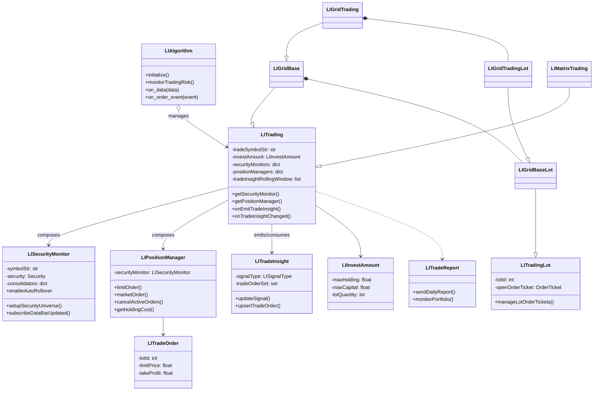

# LIATS Architecture Documentation

## Runtime Overview
- `core/LIAlgorithm.py` is the QuantConnect entry point. It bootstraps Lean settings, instantiates `LITrading` strategies, schedules risk/report jobs, and fans out Lean lifecycle callbacks to every strategy instance.
- Each strategy extends `LITrading` (`core/LITrading.py`). The base class wires configuration, charts, risk rules, metadata, and the "services" it needs (security monitors, position managers, indicators, trade insight queue).
- Market data is funneled through `LISecurityMonitor` (`core/LISecurityMonitor.py`), which manages universes, consolidators, expiry rollovers, and publishes bar-based callbacks. Multiple monitors can coexist per strategy (signal vs. trade symbol).
- Execution is centralized in `LIPositionManager` (`core/LIPositionManager.py`). It wraps QC order APIs, enforces sizing rules from `LIInvestAmount`, applies stop/limit/trailing logic, and keeps exchange-state helpers (market hours, multipliers, etc.).
- Trade decisions travel as `LITradeInsight` objects, optionally carrying `LITradeOrder` payloads. Strategies and indicators mutate these insights; position managers read them when generating orders.
- Reporting/metadata helpers in `LITradeReport` and `LICommon` persist session state (object store), aggregate PnL, and push daily/weekly notifications.

## Core Package Layers

1. **Algorithm Host (`LIAlgorithm`)**
   - Configures Lean (time zone, brokerage, cash, default properties) and schedules observers like `monitorTradingRisk`, `sendDailyReport`, and `sendWeeklyReport`.
   - Holds `self.liStrategies` and forwards every Lean event (`on_data`, `on_order_event`, brokerage/connectivity hooks, `on_end_of_algorithm`, etc.) to each strategy.

2. **Strategy Engine (`LITrading` base)**
   - Normalizes configuration (`LIConfiguration` defaults + deploy overrides) and exposes helpers: `getSecurityMonitor`, `getPositionManager`, profit/position math, metadata keys, notification builders.
   - Maintains rolling windows of `LITradeInsight`, orchestrates charting, and reacts to signal changes (`onTradeInsightChanged`) to trigger risk actions (ex: flip/liquidate on signal reversal).

3. **Monitoring & Insight Fabric**
   - `LISecurityMonitor` creates the Lean security/universe, attaches consolidators per resolution, keeps rolling OHLC state (open/high/low/close), and fires listeners for data bars, day-gap events, security changes, etc.
   - Indicator stacks (`indicator/LIComboTrendingIndicator.py`, `indicator/LIBollingerBandsIndicator.py`, etc.) subscribe to monitors and emit `LITradeInsight` instances back to `LITrading`.

4. **Position & Order Control**
   - `LIPositionManager` wraps IBKR order properties and Lean order helpers (`market_order`, `limit_order`, `stop_limit_order`, etc.), tracks portfolio holdings, cancels/retries tickets, and contains liquidity utilities (liquidate, soften/harden limit prices, leak detection).
   - `LITradingLot` provides the generic lot life cycle, `LIGridBaseLot` extends it with grid metadata, and `LIGridTradingLot` further specializes grid behavior for live trading (managing open/close tickets, trailing prices, accrued fees, realized PnL).
   - `LITradeOrder` is a light descriptor (lot id, amount, limit, take-profit, stop-loss) passed within insights or spreadsheet-driven strategies.

5. **Strategy Implementations**
   - `LIGridBase`/`LIGridTrading` implement contrarian, momentum, boosting, command, and buy-and-hold grid paradigms with extensive configuration validation and metadata-backed state machines.
   - `LIMatrixTrading` consumes spreadsheet instructions, turns each row into `LITradeInsight` + delegated `LIGridTrading` execution.

6. **Reporting & Metadata**
   - `LITradeReport` aggregates closed trades, pulls IBKR Flex statements, and emits daily/weekly notifications plus optional REST updates.
   - `LICommon` defines `LIGlobal` runtime globals (timezone, scheduling constants, metadata helpers), enums (strategy codes, grid modes, priorities), and common math/time utilities.
   - Metadata (object store) captures session IDs, start prices, paused lots, trailing stops, and aggregate PnL for crash-safe restarts.

## Core Package Class Diagram

## Component Reference

| Layer | Key Files | Responsibilities |
| --- | --- | --- |
| Algorithm Host | `core/LIAlgorithm.py` | Lean configuration, scheduling, risk watchdog, lifecycle fan-out. |
| Strategy Base | `core/LITrading.py`, `core/LIInvestAmount.py` | Strategy composition, config validation, metadata keys, charting, insight routing, profit math. |
| Monitoring | `core/LISecurityMonitor.py`, `indicator/*` | Universe management, consolidators, day-gap detection, indicator pipelines, signal publication. |
| Execution | `core/LIPositionManager.py`, `core/LITradingLot.py`, `core/LITradeOrder.py` | Order submission/cancellation, lot state, trailing/stop logic, leakage detection, liquidation helpers. |
| Grid Stack | `core/LIGridBase.py`, `core/LIGridTrading.py`, `core/LIGridBaseLot.py`, `core/LIGridTradingLot.py` | Grid session lifecycle, lot graphs, tiered sizing, boost/command modes, metadata-backed restarts. |
| Matrix Strategy | `core/LIMatrixTrading.py` | Spreadsheet ingestion, per-row insights, delegation to `LIGridTrading`. |
| Reporting & Globals | `core/LITradeReport.py`, `core/LICommon.py`, `core/LIConfiguration.py` | Notifications, IBKR Flex parsing, metadata helpers, global constants, enum definitions. |

## Data & Control Flow

1. **Configuration & Bootstrap**
   - `LIAlgorithm.initialize()` loads defaults from `LIConfiguration`, applies deployment overrides, and registers time-based callbacks. Each strategy instance is appended to `self.liStrategies` and immediately calls `notifySettings()` for audit trails.

2. **Security Setup**
   - When a strategy calls `getSecurityMonitor()`, `LISecurityMonitor` creates/filters the Lean security (`add_equity`, `add_future`, `add_option`, etc.), sets consolidators, and optionally warms up historical data (`initSecurityMonitor`).
   - `LITrading.getPositionManager()` wires the monitor to a `LIPositionManager`, ensuring consistent sizing rules from `LIInvestAmount` and hooking chart references.

3. **Market Data Pipeline**
   - Consolidated bars trigger `LISecurityMonitor.onDataConsolidated`, which notifies subscribed strategies/indicators via their listener interfaces (`onMonitorBarUpdated`, `onDayOpenGapUpOrDownEvent`, etc.).
   - Indicators such as `LIComboTrendingIndicator` compute signals and call `LITrading.onEmitTradeInsight()`. The base class validates symbol alignment, fires `onTradeInsightChanged()` when signal types differ, and updates the rolling insight window.

4. **Decision to Order**
   - Strategies (grid, matrix, spreadsheet) interpret the current `LITradeInsight`. Grid modes map insights + config to per-lot actions (`manageGridTrading`, `manageGridCommand`, `manageGridBoosting`).
   - Lots rely on `LIPositionManager` for actual order tickets. The manager applies jittering, retry logic (`limitMarketOrder`), trailing stop updates, and cancel/replace behavior, respecting market-hour guards from `LISecurityMonitor`.

5. **Risk & Liquidation**
   - `LIAlgorithm.monitorTradingRisk()` plus strategy-level overrides coordinate portfolio sweeps (via `LITradeReport.monitorPortfolio`) to detect stray contracts, liquidate delisted securities, or enforce stop rules (`liquidateGridSession`, `liquidateSecurity`).
   - Metadata keys defined in `LIMetadataKey` (e.g., `startPrices`, `gridLotsMetadata`, `overallMaxProfitLoss`) are saved through `LICommon.saveMetadata` so sessions can resume after restarts.

6. **Reporting & Telemetry**
   - Order events route back into strategies (`on_order_event` → `LITrading.onOrderEvent`). Closed trade stats accumulate in `LITradeReport.addDailyClosedTrade` and are summarized in scheduled `sendDailyReport` / `sendWeeklyReport` jobs with optional IBKR/benchmark comparisons.
   - `sendAliveNotice` surfaces current insights per strategy; optional metadata dumps can be toggled via helper flags.

## Extending the Core

1. **Add a new strategy** by subclassing `LITrading` (or an existing specialization), building the required monitors/position manager inside `__init__`, and overriding lifecycle hooks (`onData`, `onEmitTradeInsight`, etc.).
2. **Define custom indicators** that subscribe to a `LISecurityMonitor`, compute signals, and call `strategy.onEmitTradeInsight()` with enriched `LITradeInsight` + `LITradeOrder` payloads.
3. **Leverage metadata** by writing session state with `saveMetadata`/`readMetadata`, enabling seamless restarts and cross-session analytics.
4. **Integrate reporting** by pushing new statistics into `LITradeReport` helpers or defining additional scheduled callbacks in `LIAlgorithm.initialize()`.

With this layering, the `core` package separates Lean orchestration, monitoring, execution, and strategy logic, making it straightforward to mix new market adapters or trading styles without rewriting the infrastructure scaffolding.
