# 阶梯计划私募基金（Staircase Project Private Fund）

**由终身投资者有限责任公司（Lifelong Investor LLC）精心打造的第1号私募基金！**

- 纳西姆·塔勒布的杠铃投资策略认为：在充满不确定性和难以预测的世界中，投资者应该把一小部分资产投资在高风险但潜在回报巨大的机会中。
- 阶梯计划私募基金即是相对激进的主动投机：程序化交易，双向对冲，使用杠杆，借力期货，高风险，高波动，去博取非对称的高收益。
- LIATS（终身投资者算法交易系统）是敏捷灵活且透明可见的，将最合适的交易策略应用于精心挑选的证券目标，有监督地进行交易。
- Trading is NOT to stay secure and comfortable, but to take risks and become wealthy.

## 该基金的特点

- 以期货交易为主，股票交易为辅，基金市值会有一定波动性，呈螺旋阶梯式上升。
- 算法交易系统会根据网格交易策略，在市场价格和技术指标的驱动下自动进行交易。
- 投资者可以随时查看或自动接收到每笔交易提示，日报周报和投资业绩走势图表等。
- 每周有投资人交流会，分工协作，学习研究期货，发掘交易机会，制定交易计划。
- 我们众人拾柴火焰高，努力将基金做大做强，争取大资金，拓宽财富之路！

## 将基金彻底透明化

- 微信群（WeChat）：终身投资者，及时沟通分享，发掘交易机会，团体监督作战。
- 电报群（Telegram）：接收系统动态，部署重启，交易提示，日报和周报等。
- 网站（lifelonginvestor.net）：公司基金信息，历史记录，业绩图表等。
- 投资人可以查看评估部分交易系统代码，提出反馈意见。
- 投资人可以直接登陆交易账号，查看交易记录和报表。
- 合伙人需要参与基金的运营和改进维护交易系统。

## 如何投资该基金？

- 启动基金为50万美元，由基金经理认购，并在未来只追加不减少投资。
- 投资人需要签署一份认购协议，最小认购金额是5万美元，可逐步加仓。
- 投资人将购买金额转账到终身投资者有限责任公司，获取各类账号设置。
- 投资人每年会收到Schedule K-1表格，直接合并到个人所得税申报。
- 基金年度收益没有超过8%时不收费，只对超出8%的部分收取15%的年费。 

## 算法交易指导思想

1. 交易是在用你的承载力（认知和可承受的风险）来换取相应的收益。
2. 交易成功的关键在于执行力！盈利来源于：做错了少亏，做对了多赚。
3. 交易亦有周期性，需要静待观望，耐心守候有利的关键点，再入场和出场。
4. 先要博学，后要专精，还要心不乱，步步检查清单，再好的策略也需要行情的配合。
5. 交易有四个基本要素：可靠的工具方法、冷静的心态情绪，严格的资金管理，和交易计划日志。
6. 资金管理是重中之重，无论任何策略都要设置止损计划。控制好交易量来提升抗波动和风险的能力。
7. 设置止损时应能承受中等程度的波动，避免因短期震荡过早出局，也要规避深度杀跌或极端逼空行情。
8. 轻仓的底层逻辑是：只要剩余资金足够多，能承受深度回调，就无所谓顺势和逆势，逆的也能扛成顺的。
9. 交易计划日志有助于事先理清思路，排除模棱两可，减轻交易压力，避免情绪紧张，事后复盘总结经验。
10. 主要是进行价格驱动的两种网格交易策略：逆势（左侧）和顺势（右侧），选择高波动且流动性好的证券。
11. 网格交易系统会按照设置自动在选定证券的一定价格范围和一段时间周期内持续多次买卖，有时需要滚动展期。
12. 逆势和顺势网格交易策略可在两个账户或对等证券之间（如NQ和MNQ）同时进行，相辅相成，起到一定的对冲作用。
13. 逆势策略是交易均值回归和周期性，通过V型反转延迟变现：其价格要在网格能承受的范围内波动或长期波动上涨。\
    通常需要忍受大幅的浮亏，等待市场回归后逐渐卖出以盈利。需要的资金量大，且容易在极端行情下被部分清算或爆仓。
14. 逆势策略中的多头交易原则：在市场高位时小仓位，在市场低位时大仓位；大跌恐慌时分批买入，大涨得意时分批卖出。\
    当市场在牛市的氛围中一轮冲高后，甚至仍在上涨时，一定要提前降低多头仓位或移动止盈，亦可通过期权进行对冲。\
    当市场在熊市的氛围中一轮杀跌后，甚至仍在下跌时，一定要提前增加多头仓位或移动买入，亦可通过期权进行对冲。
15. 逆势策略中的空头交易原则与多头交易原则正相反。但要特别注意：选择周期性回调的证券（如CL），或大概率要回调的证券。
16. 逆势策略中可以适当揉合顺势：当逆势策略处于大幅反弹时，可以乘胜追击，顺势加仓更多，并设置移动止损，争取最大化收益。
17. 顺势策略是交易路径依赖和连续性，通过频繁买卖及时变现：其价格要在某个时段内持续连贯地大幅上涨或下跌。\
    通常是要忍受多次的小亏，换来一次大赚，阶梯式螺旋上升。喜连续大起大落，怕小幅波动整理。需要的资金量小，且不容易被清算或爆仓。
18. 顺势策略的多空交易原则：跟踪趋势，以小亏损博取大收益，不要轻易干预或中断交易过程，但可以根据近期的回测结果来微调修正参数。\
    跟踪趋势的精髓就是一直紧跟着市场的步伐，永远只慢半拍，不去预测下一拍，陪着它历经中间不舒服地折返或停顿，最后没有跟丢就算赢了。\
    交易系统要严格控制亏损比例，紧紧跟随市场趋势，用不断的小额亏损来测试和捕捉大行情。有勇气不断地重复这个操作，保持一致性和连贯性。
19. 有暴利即平仓：当持仓在较短时间内获取暴利，应首先考虑获利平仓，再去研究市场剧烈波动的原因，否则将错失获利良机，所以要设置跟踪/目标止盈。
20. 善用长期期权：当某证券走出一段巨幅大涨或大跌行情后，大概率会进入一段高估回调或低估反转阶段，通过买入反向长期期权来等待市场修复，以期获利。
21. 叠加多层布林通道：充分利用通道呈现的均值回归或价格趋势，跟踪势能跃迁，动态调整起始价格和开仓价格，低概率低仓位/小批量，高概率高仓位/大批量。
22. 无需预判市场的最佳全天候交易策略是：双向对冲-逆势加仓-跟踪止盈-及时回补-控制仓位。据此开发出完善的自动化交易系统，即可实现稳定的现金流来源。
23. 交易的经验技能来源于我们无数次的探索与实践！寂静夜晚的沉思总结，挫折之后的重新崛起，坚持不懈的探寻正确路径，在市场周期中等待和忍耐，直到成功！

#### 布林通道的划分和命名

- 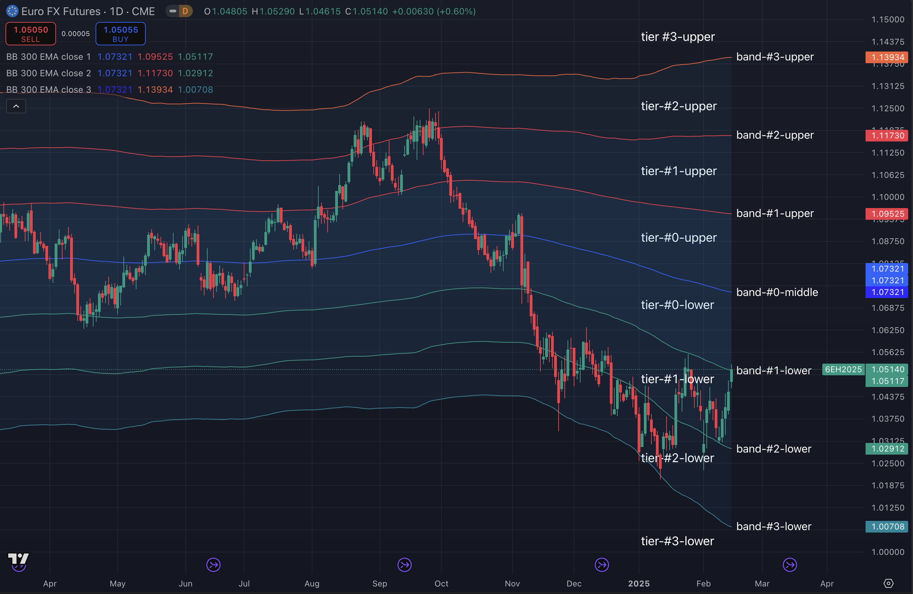

## 交易系统通知实例

- 部署通知：
    - ```YanhuaHedge 05/16T12:33 Start Grid Trading Contrarian: symbol=NasdaqTrail(MNQ), lotQuantity=2, securityType=Future, configs={aliasName: NasdaqTrail, monitorPeriod: 15, liquidateOnStopLossAmount: 200000, liquidateOnTakeProfitAmount: 50000, gridLongLots: 15, gridLotLevelPercent: 0.6, gridLotLevelAugment: 0.015, gridLotStopLossFactor: 25, gridLotStopProfitFactors: (0.5, 2), gridCancelOrdersAfterClosed: True, gridTrailingOpenPriceFactor: 1.0, gridRetainOpenedLots: 2}```
    - ```NasdaqTrail(MNQ20M25): Session#1, marketPrice=21444.25, filledLots=(4, 4, 0), investedQuantity=8, totalNetProfit=4253.26, overallMaxProfitLoss=[4239.12, 0.0], startPrices={BTD: 21710.5}, targetPrices(lot#/open/close/stopLoss)=[#1/21580.25/21600.0/18250.0, #2/21444.25/21482.0/18067.5, #3/21302.75/21470.5/17975.0, #4/21155.75/21293.0/17744.5, #5/21003.5/21557.75/17882.0, #6/20846.0/20987.75/17328.25, #7/20683.25/20827.0/17115.5, #8/20515.75/20661.5/16899.75, #9/20343.5/20491.0/16681.75, #10/20166.5/20315.75/16461.0, #11/19985.0/20136.0/16237.75, #12/19799.25/19952.0/16012.75, #13/19609.25/19763.5/15785.5, #14/19415.0/19570.5/15556.25, #15/19217.0/19374.0/15325.5]```
- 交易通知：
    - ```YanhuaHedge 05/16T10:43 Grid NasdaqTrail(MNQ20M25) Market Order (GAIN): Filled -2 at price=21348.25, fee=0.62, marketPrice=21360.0. holding 10(427799.33) now, realized/unrealized 1805.76/-620.03(-0.14494%), openPrice=20896.5, filledPrice=21348.25, totalProfitLoss=1185.73(0.23287%). [05/16T10:43 Lot#6/1: Submit CLOSING STOP PROFIT order at stopLimitPrices=21363.25|1.03571, targetPrice=21038.5, targetQuantity=-2, startPrice=21600, marketPrice=21360.0, openPrice=20896.5.]```
- 日报通知：
    - ```YanhuaHedge 05/16T18:00 Daily Report: dailyClosedTrades=3, avgDuration=0:00:00, dailyProfit=3,501.00, dailyAccruedFees=3.72, totalCapital=13,320.00, totalQuantity=6.0, dailyNetProfit=3,497.28(26.26%), overallProfitLoss=5,849.78(1.2307%), holdingQuantity=30.0, holdingCost=475,322.40. cashRemaining=47,981.06, marginRemaining=202,234.06, totalPortfolioValue=412,534.56. holdingPositions=[MCL18N25:22@60.44, MNQ20M25:8@21396.5, QQQ:700@362.73].```
- 周报通知：
    - ```YanhuaHedge 05/17T06:00 Weekly Report: weeklyClosedTrades=11, avgDuration=0:00:00, weeklyProfit=10,359.28, weeklyAccruedFees=12.40, totalCapital=167,866.00, totalQuantity=40.0, weeklyNetProfit=10,346.88(6.16%), overallProfitLoss=5,849.78(1.2307%), holdingQuantity=30.0, holdingCost=475,322.40. cashRemaining=51,366.66, marginRemaining=201,243.56, totalPortfolioValue=410,553.56. holdingPositions=[MCL18N25:22@60.44, MNQ20M25:8@21396.5, QQQ:700@362.73].```

## 回归测试业绩表现

**以下回归测试均使用50万美元为起始资金规模，交易1～5个期货品种。**

### 2023年度回测

- 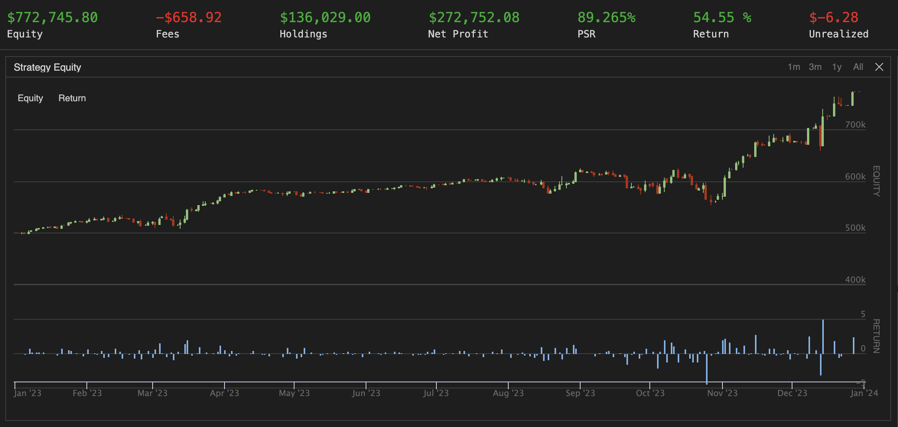
- 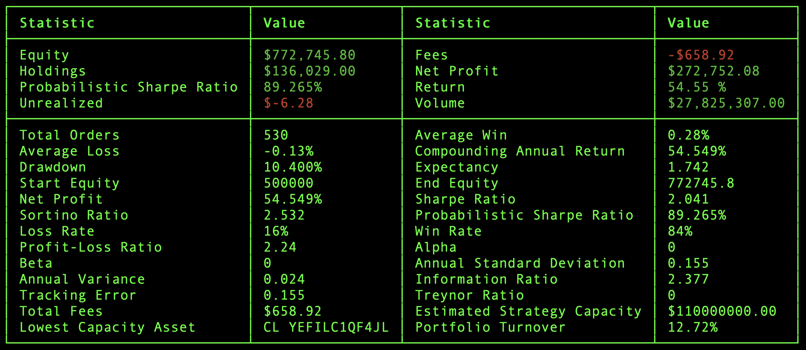

### 2024年度回测

- 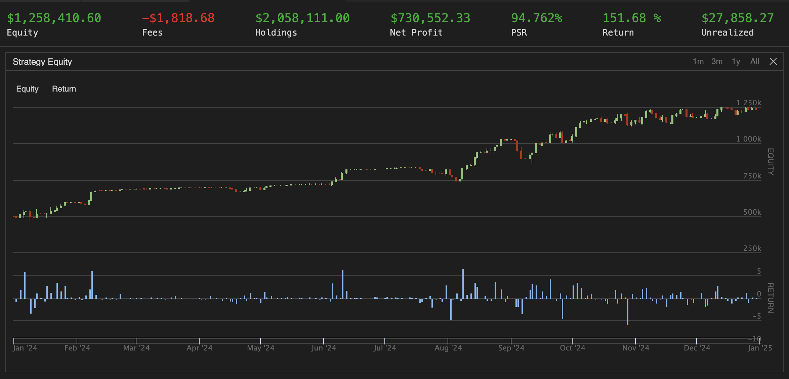
- 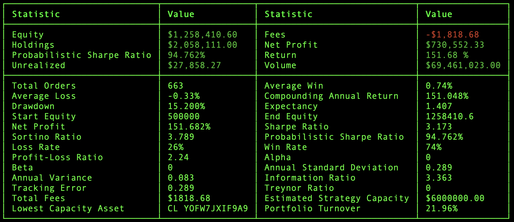

### 2025五个月回测（关税风波）

- 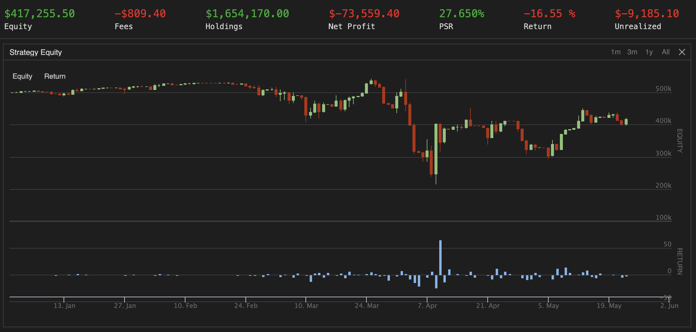
- 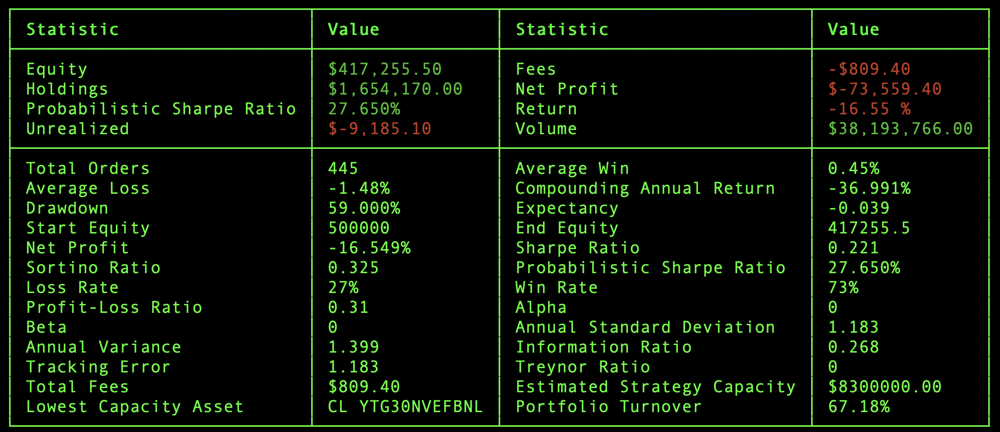

### 2025五个月顺势交易回测（关税风波）

- 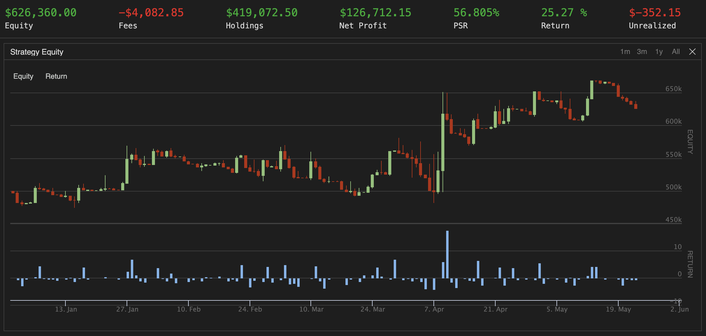
- 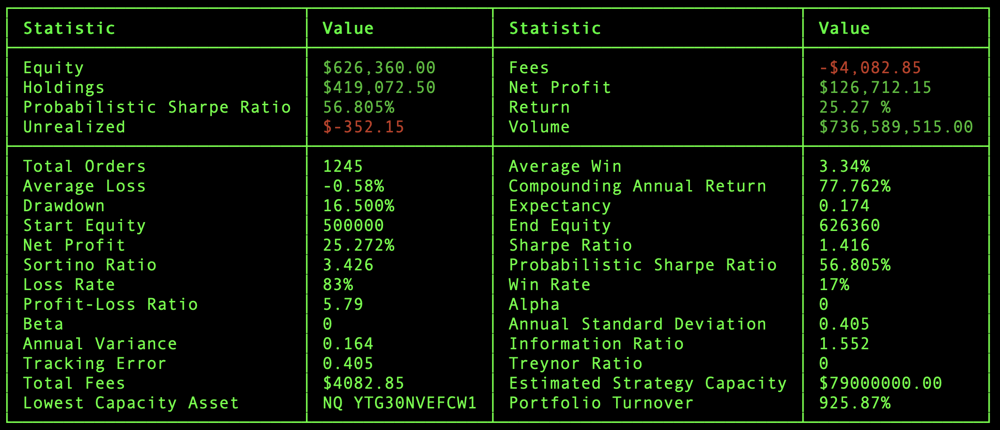

### 2025六个月通道交易回测（关税风波）

- 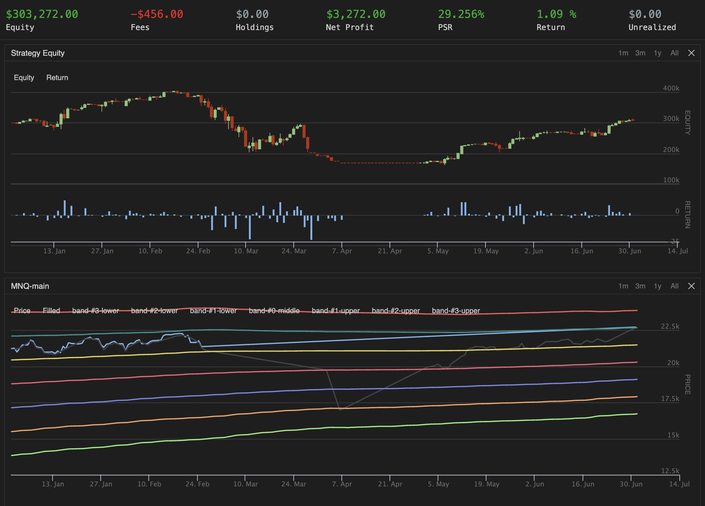
- 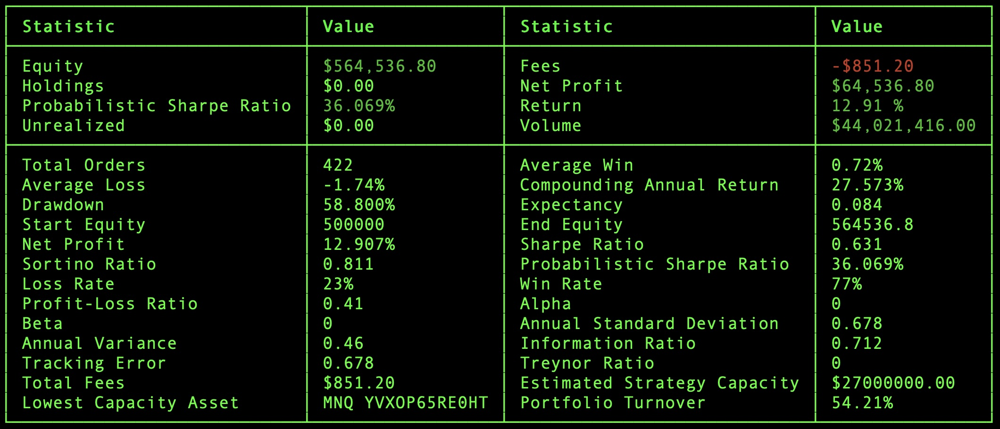
