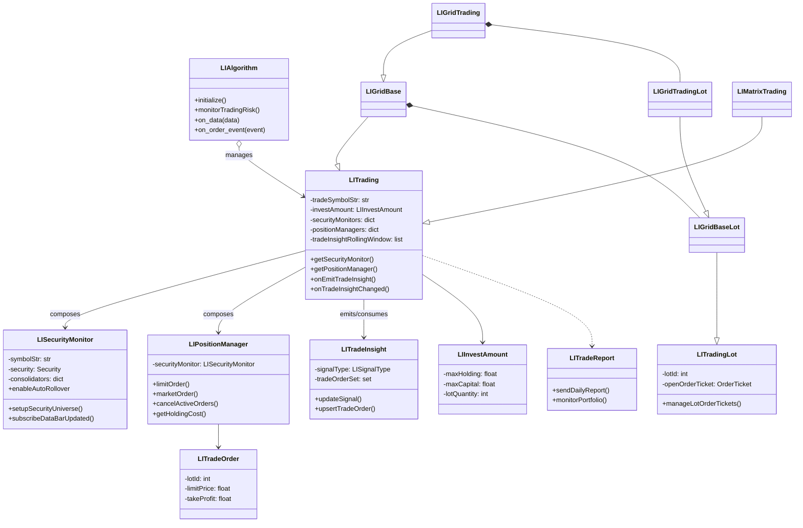
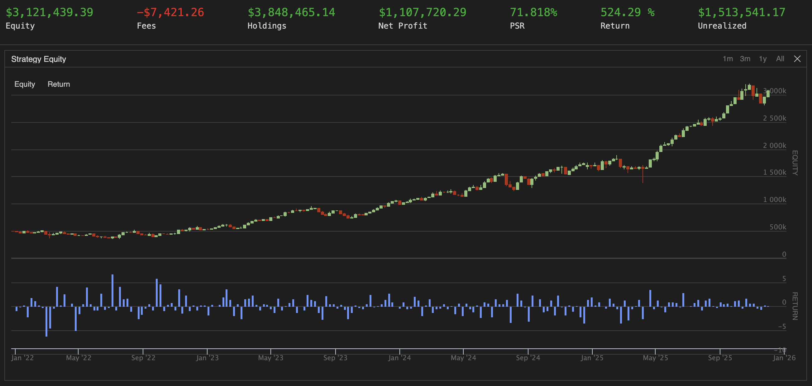
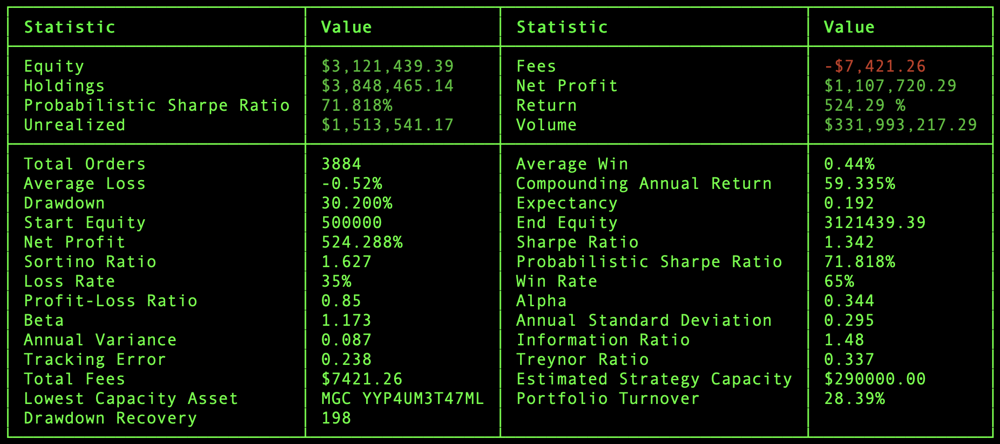

# 阶梯计划私募基金（Staircase Project Private Fund）

**由终身投资者有限责任公司（Lifelong Investor LLC）精心打造的第1号私募基金！**

- 纳西姆·塔勒布的杠铃投资策略认为：在充满不确定性和难以预测的世界中，投资者应该把一小部分资产投资在高风险但潜在回报巨大的机会中。
- 阶梯计划私募基金是相对激进的主动投机：程序化交易，双向对冲，使用杠杆，借力期货，高风险，高波动，去博取非对称的高收益。
- LIATS（终身投资者算法交易系统）是敏捷灵活且透明可见的，将最合适的交易策略应用于精心挑选的证券目标，有监督地进行交易。
- Trading is NOT to stay secure and comfortable, but to take risks and become wealthy.

## 该基金的特点

- 以期货交易为主，股票交易为辅，基金市值会有一定波动性，呈螺旋阶梯式上升。
- 算法交易系统会根据网格交易策略，在市场价格和技术指标的驱动下自动进行交易。
- 投资者可以随时查看或自动接收到每笔交易提示，日报周报和投资业绩走势图表等。
- 每周有投资人交流会，分工协作，学习研究期货，发掘交易机会，制定交易计划。
- 我们众人拾柴火焰高，努力将基金做大做强，争取大资金，拓宽财富之路！

## 将基金彻底透明化

- 微信群（WeChat）：终身投资者，及时沟通分享，发掘交易机会，团体监督作战。
- 电报群（Telegram）：接收系统动态，部署重启，交易提示，日报和周报等。
- 网站（lifelonginvestor.net）：公司基金信息，历史记录，业绩图表等。
- 投资人可以查看评估部分交易系统代码，提出反馈意见。
- 投资人可以直接登陆交易账号，查看交易记录和报表。
- 合伙人需要参与基金的运营和改进维护交易系统。

## 如何投资该基金？

- 启动基金为50万美元，由基金经理认购，并在未来只追加不减少投资。
- 投资人需要签署一份认购协议，最小认购金额是5万美元，可逐步加仓。
- 投资人将购买金额转账到终身投资者有限责任公司，获取各类账号设置。
- 投资人每年会收到Schedule K-1表格，直接合并到个人所得税申报。
- 基金年度收益没有超过8%时不收费，只对超出8%的部分收取15%的年费。

## 算法交易指导思想

1. 将长期价值投资和短期量化交易并驾齐驱方为上策！
2. 首先以长期视角和逆向策略来投资持有优秀的股权资产！
3. 投资不是为了安稳与舒适，而是为承担风险并实现财富增长。
4. 交易亦是在以自身的认知水平和风险承受力来换取相应的收益。
5. 执行力是交易成功的关键！盈利来源于：做错了少亏，做对了多赚。
6. 交易亦有周期性，需静待观望，耐心守候有利的关键点，再入场和出场。
7. 先要博学，后要专精，还要心不乱，步步检查看清单，再好的策略也需行情配合。
8. 交易的四大支柱：可靠的工具方法、冷静的心态情绪、严格的资金管理、系统的计划与日志。
9. 资金管理至关重要，任何策略都须设置止损计划。并通过控制仓位提升抵御波动与风险的能力。
10. 止损设置应能承受中等程度的波动，避免因短期震荡过早出局，也要规避深度杀跌或极端逼空行情。
11. 轻仓的底层逻辑在于：只要剩余资金充足，能够承受深度回调，则无所谓顺势逆势，逆的也能扛成顺的。
12. 交易计划与日志有助于事先理清思路，排除模棱两可，减轻交易压力，避免情绪紧张，事后复盘总结经验。
13. 主要是进行价格驱动的两种网格交易策略：逆势/左侧和顺势/右侧，选择波动率高且流动性好的证券品种。
14. 网格交易系统会按照设置自动在选定证券的一定价格范围和一段时间周期内持续多次买卖，有时需要滚动展期。
15. 逆势策略是交易均值回归和周期性，通过V型反转延迟变现：其价格要在网格能承受的范围内波动或长期波动上涨。\
    通常需要忍受大幅的浮亏，等待市场回归后逐渐卖出以盈利。需要的资金量大，且容易在极端行情下被部分清算或爆仓。
16. 逆势策略中的多头交易原则：在市场高位时小仓位，在市场低位时大仓位；大跌恐慌时分批买入，大涨得意时分批卖出。\
    当市场在牛市的氛围中一轮冲高后，甚至仍在上涨时，一定要提前降低多头仓位或移动止盈，亦可通过期权进行对冲。\
    当市场在熊市的氛围中一轮杀跌后，甚至仍在下跌时，一定要提前增加多头仓位或移动买入，亦可通过期权进行对冲。
17. 逆势策略中的空头交易原则与多头交易原则正相反。但要特别注意：选择周期性回调或大概率要回调的证券品种(如CL)。
18. 逆势策略中可以适当揉合顺势：当逆势持仓大幅反弹时，可以乘胜追击，顺势加仓更多并设置好移动止损，以扩大收益。
19. 顺势策略是交易路径依赖和趋势延续，通过频繁买卖及时变现：其价格要在某个时段内呈现连贯的上涨或下跌(单边行情)。\
    通常是要忍受多次的小亏，换来一次大赚，阶梯式螺旋上升。偏好连续大波动，畏惧窄幅盘整。资金需求较小，不易触发清算。
20. 顺势策略的多空交易原则：跟踪趋势，以小亏损博取大收益，避免轻易干预或中断交易过程，但可根据近期回测来微调修正参数。\
    趋势跟踪的精髓在于紧随市场步伐，始终保持慢半拍，不预测下一步，陪着它历经中间不舒服地折返或停顿，最后没有跟丢就算赢了。\
    交易系统要严格控制亏损比例，紧紧跟随市场趋势，用不断的小额亏损来测试和捕捉大行情。有勇气不断地重复，保持一致性和连贯性。
21. 有暴利即平仓：持仓在较短时间内获取大幅盈利时，应先考虑获利平仓，再分析市场波动原因，避免错失获利良机，建议设置跟踪/目标止盈。
22. 善用长期期权：当某证券经历大幅单边行情后，往往会进入高估回调或低估反转阶段，通过买入反向长期期权来布局，以等待市场修复获利。
23. 叠加多层布林通道：利用通道呈现的均值回归或趋势信号，跟踪势能跃迁，动态调整起始价与开仓价，低概率轻仓试探，高概率重仓布局。
24. 无需预判市场的最佳全天候交易策略：顺势而为-回撤加仓-跟踪止盈-破位止损-控制仓位。依此构建自动化交易系统，可望获得持续现金流。
25. 交易技艺来自反复的探索与实践！寂静夜晚的沉思总结，挫折之后的重新崛起，坚持不懈的探寻正确路径，在市场周期中等待和忍耐，直到成功！

### 布林通道的划分和命名


## LIATS系统架构

### LIATS项目代码结构

```text
liats/
├── main.py
├── config.json
├── accounts/
│   ├── BackTest/
│   │   ├── config.json
│   │   └── main.py
│   ├── LifelongInvest/
│   │   ├── config.json
│   │   └── main.py
│   └── YanhuaInvest/
│       ├── config.json
│       └── main.py
├── core/
│   ├── LIAlgorithm.py
│   ├── LICommon.py
│   ├── LIConfiguration.py
│   ├── LITrading.py
│   ├── LITradingLot.py
│   ├── LIGridTrading.py
│   ├── LIGridTradingLot.py
│   ├── LISecurityMonitor.py
│   ├── LIPositionManager.py
│   └── ...
├── indicator/
│   ├── LIBollingerBand.py
│   ├── LIBollingerBandsIndicator.py
│   ├── LICandlestickRollingWindow.py
│   ├── LIComboTrendingIndicator.py
│   ├── LIWeeklyTrendingIndicator.py
│   └── ...
├── equity/  forex/  future/  option/
│   └── LI<Asset>GridTrading*.py
├── docs/
│   ├── architecture.md
│   └── staircase/
│       └── staircase-project-private-fund.md
│   └── ...
├── tools/
│   ├── TestGridTrading.py
│   ├── UpsertDailyReport.py
│   ├── BenchmarkCalculation.py
│   └── ...
└── bin/
    ├── backtest
    ├── deploy
    ├── regress
    └── ...
```

### LIATS项目核心类图



## 交易系统通知实例

- 部署通知：
    - ```YanhuaHedge 05/16T12:33 Start Grid Trading Contrarian: symbol=NasdaqTrail(MNQ), lotQuantity=2, securityType=Future, configs={aliasName: NasdaqTrail, monitorPeriod: 15, liquidateOnStopLossAmount: 200000, liquidateOnTakeProfitAmount: 50000, gridLongLots: 15, gridLotLevelPercent: 0.6, gridLotLevelAugment: 0.015, gridLotStopLossFactor: 25, gridLotStopProfitFactors: (0.5, 2), gridCancelOrdersAfterClosed: True, gridTrailingOpenPriceFactor: 1.0, gridRetainOpenedLots: 2}```
    - ```NasdaqTrail(MNQ20M25): Session#1, marketPrice=21444.25, filledLots=(4, 4, 0), investedQuantity=8, totalNetProfit=4253.26, overallMaxProfitLoss=[4239.12, 0.0], startPrices={BTD: 21710.5}, targetPrices(lot#/open/close/stopLoss)=[#1/21580.25/21600.0/18250.0, #2/21444.25/21482.0/18067.5, #3/21302.75/21470.5/17975.0, #4/21155.75/21293.0/17744.5, #5/21003.5/21557.75/17882.0, #6/20846.0/20987.75/17328.25, #7/20683.25/20827.0/17115.5, #8/20515.75/20661.5/16899.75, #9/20343.5/20491.0/16681.75, #10/20166.5/20315.75/16461.0, #11/19985.0/20136.0/16237.75, #12/19799.25/19952.0/16012.75, #13/19609.25/19763.5/15785.5, #14/19415.0/19570.5/15556.25, #15/19217.0/19374.0/15325.5]```
- 交易通知：
    - ```YanhuaHedge 05/16T10:43 Grid NasdaqTrail(MNQ20M25) Market Order (GAIN): Filled -2 at price=21348.25, fee=0.62, marketPrice=21360.0. holding 10(427799.33) now, realized/unrealized 1805.76/-620.03(-0.14494%), openPrice=20896.5, filledPrice=21348.25, maxProfitLoss=1185.73(0.23287%). [05/16T10:43 Lot#6/1: Submit CLOSING STOP PROFIT order at stopLimitPrices=21363.25|1.03571, targetPrice=21038.5, targetQuantity=-2, startPrice=21600, marketPrice=21360.0, openPrice=20896.5.]```
- 日报通知：
    - ```YanhuaHedge 05/16T18:00 Daily Report: dailyClosedTrades=3, avgDuration=0:00:00, dailyProfit=3,501.00, dailyAccruedFees=3.72, totalCapital=13,320.00, totalQuantity=6.0, dailyNetProfit=3,497.28(26.26%), overallProfitLoss=5,849.78(1.2307%), holdingQuantity=30.0, holdingCost=475,322.40. cashRemaining=47,981.06, marginRemaining=202,234.06, totalPortfolioValue=412,534.56. holdingPositions=[MCL18N25:22@60.44, MNQ20M25:8@21396.5, QQQ:700@362.73].```
- 周报通知：
    - ```YanhuaHedge 05/17T06:00 Weekly Report: weeklyClosedTrades=11, avgDuration=0:00:00, weeklyProfit=10,359.28, weeklyAccruedFees=12.40, totalCapital=167,866.00, totalQuantity=40.0, weeklyNetProfit=10,346.88(6.16%), overallProfitLoss=5,849.78(1.2307%), holdingQuantity=30.0, holdingCost=475,322.40. cashRemaining=51,366.66, marginRemaining=201,243.56, totalPortfolioValue=410,553.56. holdingPositions=[MCL18N25:22@60.44, MNQ20M25:8@21396.5, QQQ:700@362.73].```

## 回归测试业绩表现

### 以50万美元为起始资金规模，从2022初到2025年底，共4年交易回测业绩表现

- 
- 
